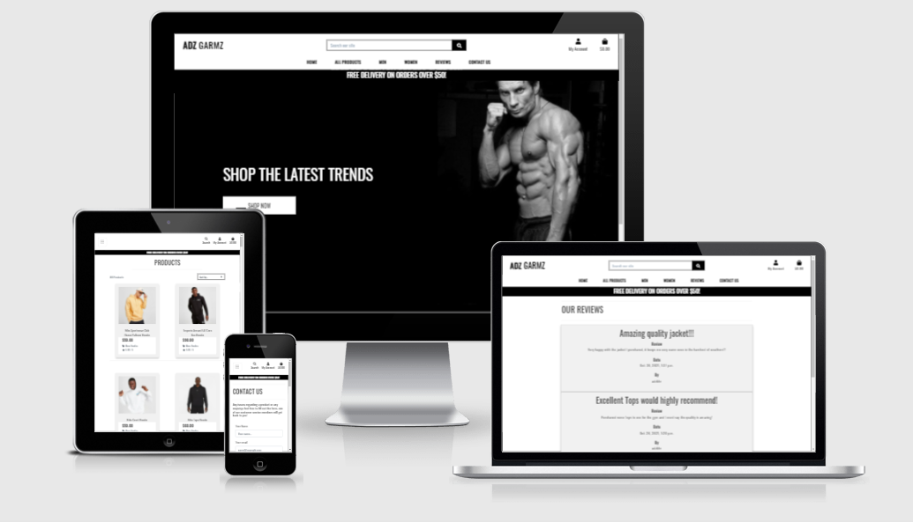
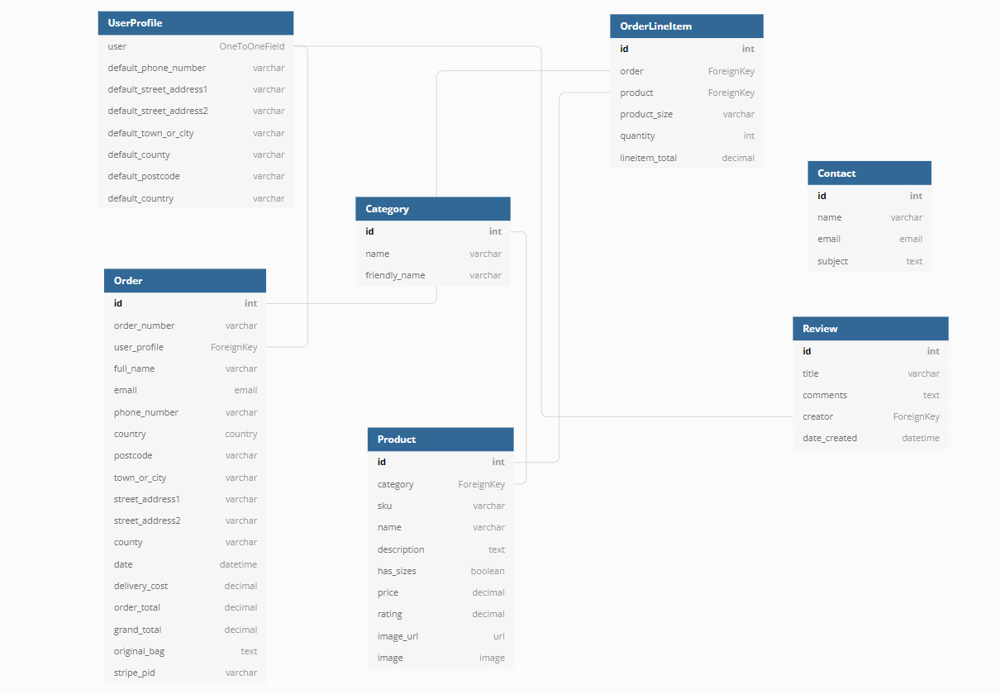
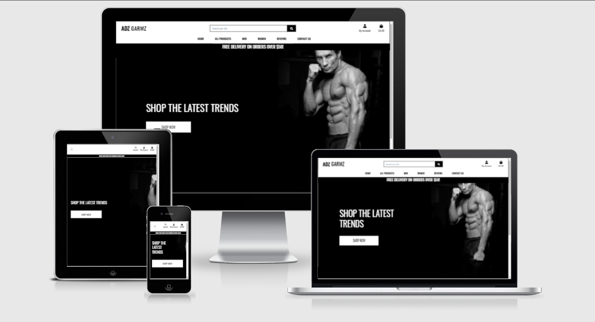
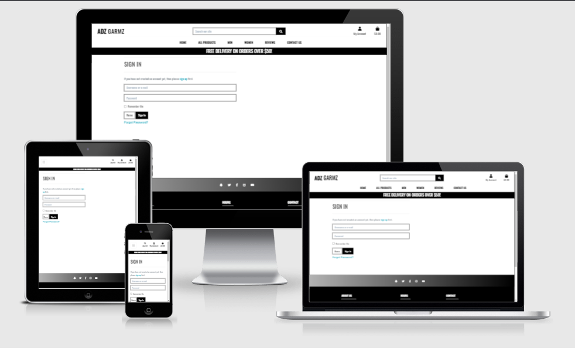
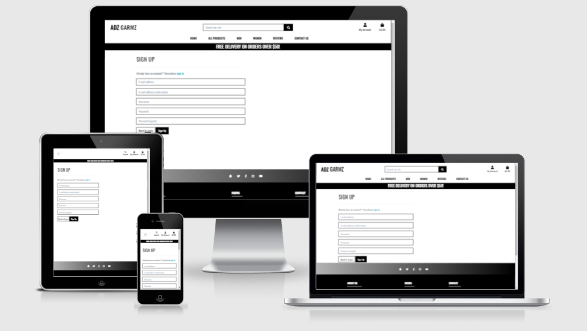
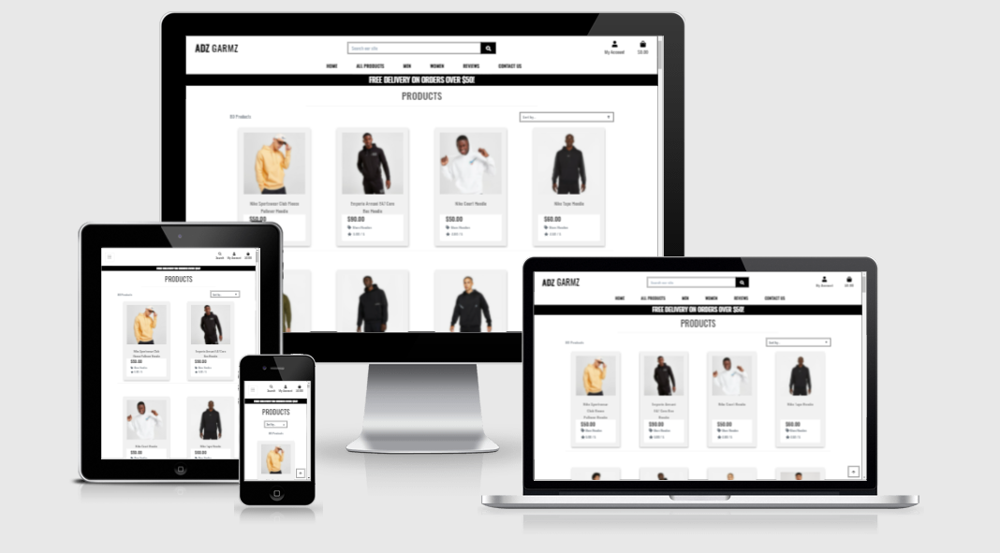
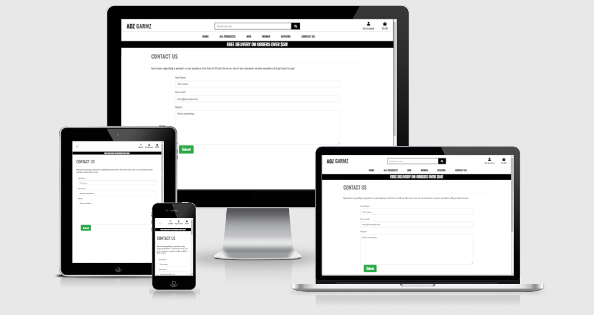
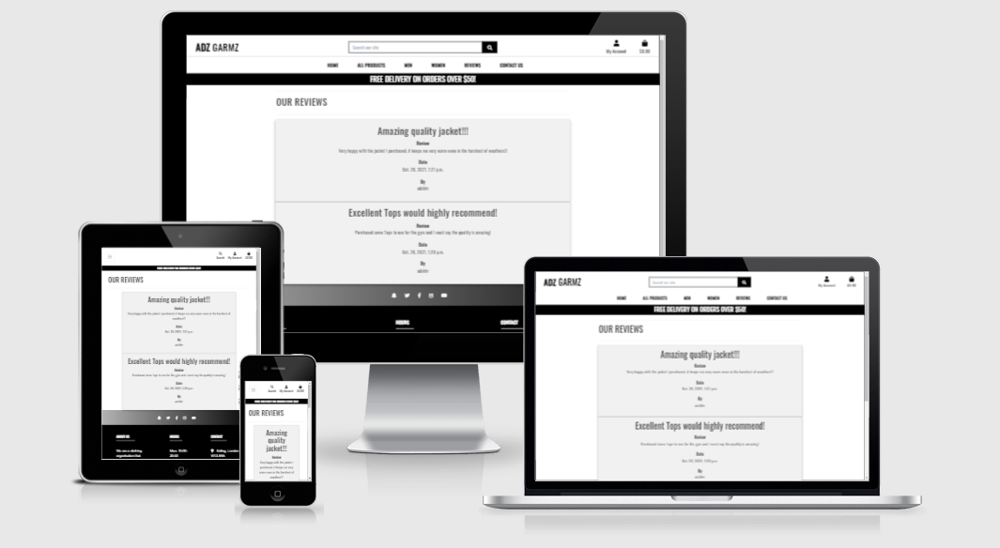

# Milestone project 4: Builiding an Ecommerce site for fitness clothing named Adz Garmz

[Link to Live Website](https://adz-garmz.herokuapp.com)

[GitHub Repo](https://github.com/adilkhr/my-ms4-project)

***

## The purpose of the project

* To use full-stack frameworks with Django to create an ecommerce site called Adz Garmz which sells fitness clothing for men and women, which allows users to create accounts, browse and purchase products, fill out any contact enquiries and view reviews of other customers, and be able to add their own review onto the site if they are a registered user.

***

## User Experience (UX)

## Strategy

### User Stories

#### First time visitor goals:

As a new user:

* I want to be able to sign up and create an account

* I want to be welcomed with a message from the home page encouraging me to purchase

* I want to be able to see what products are available and shop via category

* I want to be able to view customer reviews before I make the decision of purchasing a product(s)

* I want to be sent an email confirmation to confirm my account has been created and that the site is legit

#### Existing User goals:

As a frequent user/registered account holder of the site:

* I want to be able to save my delivery details for next time so that it saves me time

* I want to be able to view my previous orders and the order details of that purchase

* I want to be able to add and edit reviews of my experience of the e-commerce site

* I want to be able to update and edit my profile details such as my delivery details if I happen to move location

* I want to be able to recover my password if I end up forgetting it

* I want to easily log in and log out of my profile when I’m done shopping or using the site

### All User goals:

* I want to be able to contact the business in regards to any issues or enquiries I may have and once I submit my enquiry I am presented with a thank you message knowing my enquiry has gone through and has been submitted

* I want to be able to securely check out and purchase my items in my bag

* I want to be able to search for a product by name or description

* When viewing products on the site, I want to be able to sort the list of available products, eg price low to high

* I want to be able to update the content of my bag through the shopping bag application by updating the quantity of the item or just completely removing the item from my bag

* I want the site to be easy to navigate

* I want the site to be responsive and work on a majority of devices

#### Reasons for the website:

* To target more customers who are into the fitness lifestyle to then purchase our products and use them for their everyday fitness training

* To showcase work

* To allow new and existing shoppers to contact us and connect with us

* To allow registered shoppers who are regulars to the site to share the reviews on the products they purchased

## Scope
#### What a user may expect:

* Easy to navigate the application

* A site that is visually appealing on all devices

* An option to register an account

* A variety of sizes to choose from for products

* A search bar to find a specific product

* To view products via a specific category

* A login feature to log in and access their profile portal

* A variety of products that can be searched via specific categories

* A secure and safe way to checkout

#### What a user may want:

* An option to save their delivery details when they make a purchase so that it saves to for next time they check out

* To be able to view their previous order details on their profile account

* To be able to update the contents of their bag through the bag app and view the grand total of their bag to know how much they are spending

* To be able to sort the list of available products

* An option to write a review of their experience with the site

* Some sort of promotional offer that the site offers such as free delivery if they purchase a certain amount to encourage them to purchase more

#### As a developer / business I expect:

* To provide an easy feature for users to register an account

* To provide a variety of clothing options as well as sizes for all users to purchase

* To provide an easy login page for users to log in once they have successfully created their account

* To ensure users are able to securely check out

* To be able to edit and update prices of products in the admin of the site as well as add new lines of clothing here and there to give shoppers more options

* To allow registered users to create reviews and add them to the reviews page

* To also allow registered users to have the choice whether or not they would like to delete or edit their reviews on the reviews and for them to only have access to this option for their reviews

## Structure

The website will consist of a variety of pages to access via the navbar:

* A home page will contain a message displaying the message, “SHOP THE LATEST TRENDS” with a shop now button which will take users to the all products page, on the desktop the website name will be displayed on the top left with the left and when clicked on, it will direct users back to the home page

* In the navbar there will be all products link which will also have dropdown features for users to show products based on price, rating, and category,

* In the navbar there will be a men and a women link with a dropdown feature for both displaying the different types of clothes to view such as men’s hoodies, men’s tops, men’s bottoms, and men’s jackets

* There will be a search bar at the top of the page for users to search for items

* A contact us page for users to fill out any issues or questions they may have

* A reviews page for users to read other reviews, if a user is a registered user, they will have the option to create reviews with the create a review button and there will also be a delete and edit button under their review

* Shopping bag app which will store the user’s items they have added with options to update the quantity or remove from the bag, displaying their total with an option to go back or secure to the checkout page

* There will be a “my account” user icon on the top right which will have a dropdown option for users who are not logged in with “register” and “log-in”. If the user is logged in there will be a drop-down option for them to “write a review”, “profile” and “log out”

* A footer is displayed at the bottom of every page  

***

## Database

### Database Schema:

When creating the structure of the database I needed to understand how the data would link and interact with each other. I wanted it o be logical and easy to follow. Every product on my site is linked to a category eg men’s hoodies, every review created is linked to a user account, and every order is linked to a user.

Each order has its own unique order number that is created once the user’s purchase goes through and is successful. For users that have not registered, the order number is linked and provided in the email they used at the checkout.

During the development of my project used SQLite, which is provided by Django, and for production, I used Heroku Postgres. For production mode, I also had to use Amazon Web Services (AWS) to host all my static and media files.

Below is the data structure:

### Databases Used:

* Heroku Postgres for production
* sqLite3 for development
* AWS S£ for static and media files

***

## Features

### Navigation Bar:

The navbar will have a search bar for users to search for products via name or description. There will be a ‘my account’ option which will display a dropdown of register and login for users who are not logged in and a dropdown of ‘add a review’, profile, and signout for those who are logged in. A shopping bag will be displayed on the navbar showing the total value of the bag underneath the icon based on whatever the user adds to the bag.

There will be a dropdown list for All products, Men’s, and Women to browse specific products/categories

Contact us and Reviews will be displayed on the nav for users to click and direct them to the pages

The navbar will have a dropdown button for smaller screens making it very responsive and mobile-friendly

### Footer:

The footer will contain social media links for users to browse and connect with the store. The footer will have an about us section, which displays opening hours and contact information for the store. The footer matches the simple but sleek design of the navigation bar.

### Home:

The home page will contain a background image that is viewable on most desktop and laptop screens and will have a message saying “SHOP THE LATEST TRENDS” with a SHOP NOW button which will direct users to the all products page 

### Sign in/log-in page:

The sign-in page will include two input fields, username/email, and password, it will also include a remember me checkbox for users to click so that it automatically remembers them so they don't have to log in every time, it will also have a message displaying “If you have not created an account yet, then please sign up first” where it will have a link to the registration page for users to create an account. The user will also be presented with two buttons one to sign in and the other to go back to the home page

### Register/signup page:

A page for new users to register an account which will have input fields to add their email address along with email address confirmation, a username of their choice, and a password which they will have to input again to confirm once they register. Once they have filled in the form they are then sent an email to verify their account. The sign-up page will also have a message saying, “Already have an account? Then please sign in” which will contain a link to the sign-in page

### Profile page:

This profile page will be available for users once they have created an account, it will display their default delivery information as well as the option to edit and update it. This page will also contain the registered user’s order history which they can click and see the confirmation of the order

### All Products pages including Men’s and Women’s pages:

The site will have a feature for users to shop all products and can pick between ordering the products from price, rating, and category from all products drop down link on the navbar, when users click on one, they will be presented with the page showcasing the products, this will be the same with men and women, where there will be a drop-down link where you can shop based on gender and choose the type of clothing you are interested in browsing. When the users are on the products page they will have an option to sort the products depending on the list they prefer such as price low to high.

### Log out:

This will be available for users that are currently logged in and would like to log out once they are done

### Contact us page:

This page will be available for all users to input any questions or enquiries they may have regarding any products or any issues. Once they fill out the field with their name, email address, and the message and submit it, they are presented with a thank you message to let them know that their message has gone through and will be reviewed

### Review page:

The review page will allow users to read reviews from other shoppers and allow registered users to share their experience with the site and products they have purchased, it will also allow registered users to add and edit reviews as well as delete reviews they may want to take down

### Shopping bag page: 

The shopping bag page will contain whatever the user decided to select and add to the bag from the products pages. When users go on the shopping bag, they will be able to view the items of the bag as well as the grand total, users will be able to update the contents of the bag such as removing an item from the bag or increasing the quantity of the product, they are presented with an option to either check out if they are done browsing or an option to keep shopping if they still want to browse

### Checkout page:

The checkout page will be where users add their delivery details as well as their payment details to purchase. The user will be given the option to save their delivery details for next time if they are logged in. Payment has been set up through stripe

***

## Future Features 

* Customisable features for registered users to change color schemes of their profile and the site

* An option for registered users to add a profile image

* An option for registered users to delete their account

* A customer service team getting back to users in regards to their enquiries when filling out the contact form

* To add new lines of clothing every week or so to update and add more choice to the users and shoppers of the site

* An option for users to filter products based on color as some users may have different preferences based on the color of clothes

***

## Skeleton

### Wireframes:

Note: Wireframes for the desktop and mobile both share a similar structure for tablet depending on the screen size for tablet as some tablets will have a dropdown navbar like mobile screens

* Wireframes for desktop have been created and can be viewed [here](https://github.com/adilkhr/my-ms4-project/blob/main/wireframes/wireframesms4desktop.pdf)

* Wireframes for the mobile phones have been created and can be viewed [here](https://github.com/adilkhr/my-ms4-project/blob/main/wireframes/wireframesms4phone.pdf)

### Mockup:

***

