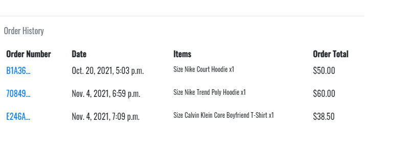
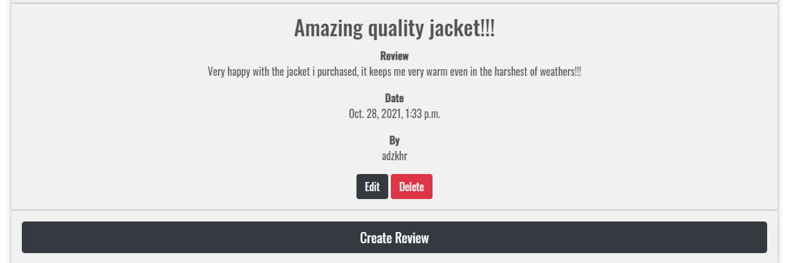
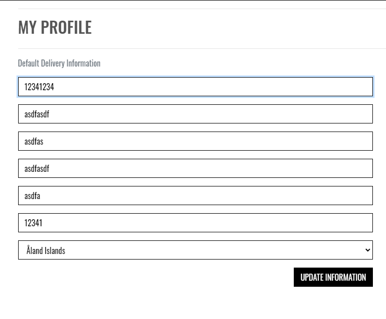
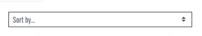
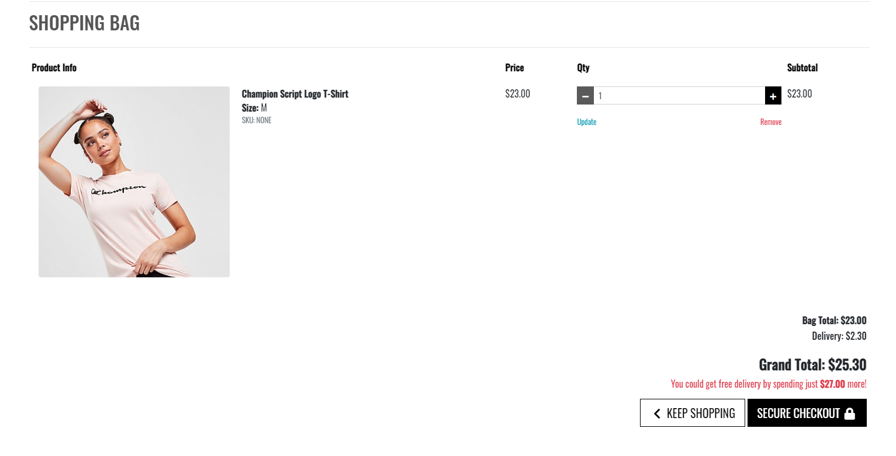

# Milestone project 4: Builiding an Ecommerce site for fitness clothing named Adz Garmz


[Link to Live Website](https://adz-garmz.herokuapp.com)

[GitHub Repo](https://github.com/adilkhr/my-ms4-project)

***

## The purpose of the project

* To use full-stack frameworks with Django to create an ecommerce site called Adz Garmz which sells fitness clothing for men and women, which allows users to create accounts, browse and purchase products, fill out any contact enquiries and view reviews of other customers, and be able to add their own review onto the site if they are a registered user.

***

## User Experience (UX)

## Strategy

### User Stories

#### First time visitor goals:

As a new user:

* I want to be able to sign up and create an account

* I want to be welcomed with a message from the home page encouraging me to purchase

* I want to be able to see what products are available and shop via category

* I want to be able to view customer reviews before I make the decision of purchasing a product(s)

* I want to be sent an email confirmation to confirm my account has been created and that the site is legit


#### Existing User goals:

As a frequent user/registered account holder of the site:

* I want to be able to save my delivery details for next time so that it saves me time

* I want to be able to view my previous orders and the order details of that purchase

* I want to be able to add and edit reviews of my experience of the e-commerce site

* I want to be able to update and edit my profile details such as my delivery details if I happen to move location

* I want to be able to recover my password if I end up forgetting it

* I want to easily log in and log out of my profile when I’m done shopping or using the site


### All User goals:

* I want to be able to contact the business in regards to any issues or enquiries I may have and once I submit my enquiry I am presented with a thank you message knowing my enquiry has gone through and has been submitted

* I want to be able to securely check out and purchase my items in my bag

* I want to be able to search for a product by name or description

* When viewing products on the site, I want to be able to sort the list of available products, eg price low to high

* I want to be able to update the content of my bag through the shopping bag application by updating the quantity of the item or just completely removing the item from my bag


#### Reasons for the website:

* To target more customers who are into the fitness lifestyle to then purchase our products and use them for their everyday fitness training

* To showcase work

* To allow new and existing shoppers to contact us and connect with us

* To allow registered shoppers who are regulars to the site to share the reviews on the products they purchased

## Scope
#### What a user may expect:

* Easy to navigate the application

* A site that is visually appealing on all devices

* An option to register an account

* A variety of sizes to choose from for products

* A search bar to find a specific product

* To view products via a specific category

* A login feature to log in and access their profile portal

* A variety of products that can be searched via specific categories

* A secure and safe way to checkout


#### What a user may want:

* An option to save their delivery details when they make a purchase so that it saves to for next time they check out

* To be able to view their previous order details on their profile account

* To be able to update the contents of their bag through the bag app and view the grand total of their bag to know how much they are spending

* To be able to sort the list of available products

* An option to write a review of their experience with the site

* Some sort of promotional offer that the site offers such as free delivery if they purchase a certain amount to encourage them to purchase more


#### As a developer / business I expect:

* To provide an easy feature for users to register an account

* To provide a variety of clothing options as well as sizes for all users to purchase

* To provide an easy login page for users to log in once they have successfully created their account

* To ensure users are able to securely check out

* To be able to edit and update prices of products in the admin of the site as well as add new lines of clothing here and there to give shoppers more options

* To allow registered users to create reviews and add them to the reviews page

* To also allow registered users to have the choice whether or not they would like to delete or edit their reviews on the reviews and for them to only have access to this option for their reviews


## Structure

The website will consist of a variety of pages to access via the navbar:

* A home page will contain a message displaying the message, “SHOP THE LATEST TRENDS” with a shop now button which will take users to the all products page, on the desktop the website name will be displayed on the top left with the left and when clicked on, it will direct users back to the home page

* In the navbar there will be all products link which will also have dropdown features for users to show products based on price, rating, and category,

* In the navbar there will be a men and a women link with a dropdown feature for both displaying the different types of clothes to view such as men’s hoodies, men’s tops, men’s bottoms, and men’s jackets

* There will be a search bar at the top of the page for users to search for items

* A contact us page for users to fill out any issues or questions they may have

* A reviews page for users to read other reviews, if a user is a registered user, they will have the option to create reviews with the create a review button and there will also be a delete and edit button under their review

* Shopping bag app which will store the user’s items they have added with options to update the quantity or remove from the bag, displaying their total with an option to go back or secure to the checkout page

* There will be a “my account” user icon on the top right which will have a dropdown option for users who are not logged in with “register” and “log-in”. If the user is logged in there will be a drop-down option for them to “write a review”, “profile” and “log out”

* A footer is displayed at the bottom of every page  

***

## Database

### Database Schema:

When creating the structure of the database I needed to understand how the data would link and interact with each other. I wanted it o be logical and easy to follow. Every product on my site is linked to a category eg men’s hoodies, every review created is linked to a user account, and every order is linked to a user.

Each order has its own unique order number that is created once the user’s purchase goes through and is successful. For users that have not registered, the order number is linked and provided in the email they used at the checkout.

During the development of my project used SQLite, which is provided by Django, and for production, I used Heroku Postgres. For production mode, I also had to use Amazon Web Services (AWS) to host all my static and media files.

Below is the data structure:


### Databases Used:

* Heroku Postgres for production
* sqLite3 for development
* AWS S£ for static and media files

***

## Features

### Navigation Bar:

The navbar will have a search bar for users to search for products via name or description. There will be a ‘my account’ option which will display a dropdown of register and login for users who are not logged in and a dropdown of ‘add a review’, profile, and signout for those who are logged in. A shopping bag will be displayed on the navbar showing the total value of the bag underneath the icon based on whatever the user adds to the bag.

There will be a dropdown list for All products, Men’s, and Women to browse specific products/categories

Contact us and Reviews will be displayed on the nav for users to click and direct them to the pages

The navbar will have a dropdown button for smaller screens making it very responsive and mobile-friendly

### Footer:

The footer will contain social media links for users to browse and connect with the store. The footer will have an about us section, which displays opening hours and contact information for the store. The footer matches the simple but sleek design of the navigation bar.

### Home:

The home page will contain a background image that is viewable on most desktop and laptop screens and will have a message saying “SHOP THE LATEST TRENDS” with a SHOP NOW button which will direct users to the all products page 

### Sign in/log-in page:

The sign-in page will include two input fields, username/email, and password, it will also include a remember me checkbox for users to click so that it automatically remembers them so they don't have to log in every time, it will also have a message displaying “If you have not created an account yet, then please sign up first” where it will have a link to the registration page for users to create an account. The user will also be presented with two buttons one to sign in and the other to go back to the home page

### Register/signup page:

A page for new users to register an account which will have input fields to add their email address along with email address confirmation, a username of their choice, and a password which they will have to input again to confirm once they register. Once they have filled in the form they are then sent an email to verify their account. The sign-up page will also have a message saying, “Already have an account? Then please sign in” which will contain a link to the sign-in page

### Profile page:

This profile page will be available for users once they have created an account, it will display their default delivery information as well as the option to edit and update it. This page will also contain the registered user’s order history which they can click and see the confirmation of the order

### All Products pages including Men’s and Women’s pages:

The site will have a feature for users to shop all products and can pick between ordering the products from price, rating, and category from all products drop down link on the navbar, when users click on one, they will be presented with the page showcasing the products, this will be the same with men and women, where there will be a drop-down link where you can shop based on gender and choose the type of clothing you are interested in browsing. When the users are on the products page they will have an option to sort the products depending on the list they prefer such as price low to high.

### Log out:

This will be available for users that are currently logged in and would like to log out once they are done

### Contact us page:

This page will be available for all users to input any questions or enquiries they may have regarding any products or any issues. Once they fill out the field with their name, email address, and the message and submit it, they are presented with a thank you message to let them know that their message has gone through and will be reviewed

### Review page:

The review page will allow users to read reviews from other shoppers and allow registered users to share their experience with the site and products they have purchased, it will also allow registered users to add and edit reviews as well as delete reviews they may want to take down

### Shopping bag page: 

The shopping bag page will contain whatever the user decided to select and add to the bag from the products pages. When users go on the shopping bag, they will be able to view the items of the bag as well as the grand total, users will be able to update the contents of the bag such as removing an item from the bag or increasing the quantity of the product, they are presented with an option to either check out if they are done browsing or an option to keep shopping if they still want to browse

### Checkout page:

The checkout page will be where users add their delivery details as well as their payment details to purchase. The user will be given the option to save their delivery details for next time if they are logged in. Payment has been set up through stripe

***

## Future Features 

* Customisable features for registered users to change color schemes of their profile and the site

* An option for registered users to add a profile image

* An option for registered users to delete their account

* A customer service team getting back to users in regards to their enquiries when filling out the contact form

* To add new lines of clothing every week or so to update and add more choice to the users and shoppers of the site

* An option for users to filter products based on color as some users may have different preferences based on the color of clothes

***

## Skeleton

### Wireframes:

Note: Wireframes for the desktop and mobile both share a similar structure for tablet depending on the screen size for tablet as some tablets will have a dropdown navbar like mobile screens

* Wireframes for desktop have been created and can be viewed [here](https://github.com/adilkhr/my-ms4-project/blob/main/wireframes/wireframesms4desktop.pdf)

* Wireframes for the mobile phones have been created and can be viewed [here](https://github.com/adilkhr/my-ms4-project/blob/main/wireframes/wireframesms4phone.pdf)

### Mockup:


***

## Typography and color scheme

* For Typography I used google fonts to then apply the Oswald font all around the site along with Roboto, sans-serif for other parts of the site.

* The color scheme used around my site was mainly black, white, and shades of greys which was applied in a sleek and simple manner using CSS and bootstrap

***

## Technologies Used

### Languages & Frameworks

* HTML5 - Mark-up language used to create the pages for the site using a semantic structure
* CCS3 - Cascading style sheet used to style the site, as well as adding media queries to make it responsive for pretty much all devices
* [Bootstrap](https://getbootstrap.com/docs/4.0/getting-started/introduction/) - CSS Framework used for structure, buttons, and some styling around the site, as well as media functions for images
* Javascript - The programming language used to create functions working for the site
* Python - The programming language used to control backend development of the site
* Django - Framework + Extensions
* [jQuery](https://jquery.com/) - Used
* [Gitpod.io](https://www.gitpod.io/) - Used for creating the workspace for writing the code. Using the command line terminal for committing and pushing to GIT Hub
* [GitHub](https://github.com/) - Used for hosting repositories
* GIT - Used for pushing the code to repositories

### Front End

* [Google fonts](https://fonts.google.com/) - Used for the Font
* [Font Awesome](https://fontawesome.com/) - For the icons used

### Backend

* [Stripe](https://stripe.com/gb) - Used to create the payment system for the site
* [Heroku](https://id.heroku.com/login) - Used to host the deployed project
* [AWS](https://aws.amazon.com) - Used to host static files and Images for the deployed site

### Planning

* [Balsamic Wireframes](https://balsamiq.com/) - Used to create the wireframe designs of the site
* [dbdiagram](https://dbdiagram.io/home) - Used to create the data structure of my project database
* [google docs](https://docs.google.com/) -  Used to create the readme to minimize spelling and grammar errors
* [am i responsive](http://ami.responsivedesign.is/) - Used to create mockup images for my site

***

## Testing

### Supported Screens:

After using some elements of bootstrap to build my pages and the use of CSS media queries styles, using the google inspect tool I was able to see that my site is supported for all modern screens with a width of 300px and above. I also did some testing by sending my website link to my friend’s and family’s devices and they had seen no issues.

### Supported browsers:

The website link has been tested on Google Chrome, Internet Explorer and Microsoft Edge, Brave, and Firefox and seems to be working fine.

### OS compatibility:

Tested on iOS, Android 10, and Windows 10. - I asked a friend with an Android to test that it was working. Tested for responsiveness using Chrome DevTools.

### Performance Testing:

* Tested on the Developer Tools Lighthouse

* I had family and friends test the site on a different device to see if there were any major issues they were having when using or accessing the site and turns out they had found no major issues. I also had friends test the site by creating an account and placing an order and there seemed to be no major issues with functionality as well as adding a review to the reviews page

### Testing User Stories:

#### New User

* I want to be able to sign up and create an account - Users are able to create an account through the signup page

* I want to be welcomed with a message from the home page encouraging me to purchase - When new users enter the site they are presented with a message saying “shop the latest trends” with a shop now button which will direct them to all products page

* I want to be able to see what products are available and shop via category - Users can select either between all products, Men’s and Women’s When selecting the either men’s or women they can shop based on the category of clothing eg men’s jackets

* I want to be able to view customer reviews before I make the decision of purchasing a product(s) - Users can view customer reviews on the reviews page that are created by registered users

* I want to be sent an email confirmation to confirm my account has been created and that the site is legit - When the user signs up they are sent an Email to verify their account

#### Existing User

* I want to be able to save my delivery details for next time so that it saves me time - When users sign in they have an option to save their delivery details at the checkout page

* I want to be able to view my previous orders and the order details of that purchase - When registered users create an account, whatever orders they purchased is saved and they can view it any time on their profile page



* I want to be able to add and edit reviews of my experience of the e-commerce site - Users are able to edit and create reviews on the reviews page through the create review button or in my account there will be an add review link



* I want to be able to update and edit my profile details such as my delivery details if I happen to move location - Users are able to edit their delivery details whenever on their profile page



* I want to be able to recover my password if I end up forgetting it - Users have an option to recover their password on the login page

* I want to easily log in and log out of my profile when I’m done shopping or using the site - Users are able to log out through the logout page

#### All Users

* I want to be able to contact the business in regards to any issues or enquiries I may have and once I submit my enquiry I am presented with a thank you message knowing my enquiry has gone through and has been submitted - Users are able to fill out the contact form which will save their name, email, and message and will be saved in the database, they are then directed to a thank you page with an option to go back to the home page

* I want to be able to securely check out and purchase my items in my bag - Users are able to checkout and pay securely with the stripe payment system

* I want to be able to search for a product by name or description - Users are able to search for products with the search bar in the navbar

*  When viewing products on the site, I want to be able to sort the list of available products, eg price low to high - when users go on a products page, they are able to sort the product based on price, category, and rating through the sort by drop-down function



* I want to be able to update the content of my bag through the shopping bag application by updating the quantity of the item or just completely removing the item from my bag - Users are able to update the quantity of the products in their bag and can also remove the item from the bag




### Code Validation:

* All my pages of the website were run through the [HTML Validator](https://validator.w3.org/#validate_by_input), because of Django being a templating language, the code when input was not showing the HTML code being valid, however, I copied the HTML code on within DEV Tools, both by viewing page source and from within the inspect as HTML and passed it into the validators to check the validity which most of my pages showed validity, however when viewing the page source of the shopping bag page, whenever there is an item in the bag there seems to be a duplicate id error of remove_, this is because the way it was implemented in the Boutique ado project (which I followed as recommended by my mentor) as I have two different elements with the remove and same id - using the hidden functionality to change between screen sizes, so they both have the same id in the page source but only one is displaying at a time. Overall the functionality of the bag is working perfectly.

* The [CSS Validator](https://jigsaw.w3.org/css-validator/#validate_by_input) was used to check the validity of my CSS code which turned out to be all fine with no faults

* [jshint](https://jshint.com/) was used to check the validity of my javascript code which turned out to be all fine with no faults

* [Pep8 Online](http://pep8online.com/) was used to check for Pep8 compliances for my python file and test the validity of the code, which the code turned out to be all good


### Fixed bugs:

* I had an issue with the footer on my profile page displaying white space on the left and right, this was because I had an unclosed div which caused this, closed the div and it had resolved it.

* I had an issue with the footer creating white spaces on pages that didn't have much content, I resolved this by creating a class and adding CSS styling called no-floating-footer which I added a min-height of 100%

* I had an issue with my reviews pages having a horizontal scroll on mobile, this was because I had a div with a class row outside of a div with a class container, once I removed the div class of row it had fixed it

* I had an issue where the font style I wanted to apply was not displaying, this was because I forgot to add the link rel=“style sheet” in the base.html

* I has an issue with my home page button not displaying in my navbar for tablet screens between 767px - 991px, this was because I had the class d-md-none to the li home element which caused it not to appear on medium screen sizes

***

## Deployment

This project was developed using [Gitpod IDE](https://gitpod.io) and pushed to Github using the in-built terminal. However, because Github can only host static websites it was required to deploy this project to Heroku as it is a compatible hosting platform for a back-end focused site like Adz Garmz. The main branch of this repository is the most current version and has been used for the deployed version of the site.

The Code Institute student template was used to create this project.

[Code Institute Full Template](https://github.com/Code-Institute-Org/gitpod-full-template)

This project was deployed using Heroku and stored in GitHub.

### Project and Repository Creation

1. Navigate to [Github](https://github.com/).
2. Create a new repository by first clicking the green button labeled new on the top left of the screen.
3. Select the Code Institute template in the templates section.
4. Give the repository a name, in this scenario, adilkhr/my-ms4-project.
5. Click the green 'Create Repository' button at the bottom of the page.
6. Inside the repository click the green 'gitpod' button to initialize your repository.
8. Future access to this workspace must be gained through gitpod workspaces, clicking the green button in gitpod again will initialize a new workspace.
9. Use the `git add .` command to add all modified and new files to the staging area.
10. Use the `git commit -m` command to commit a change to the local repository.
11. Use the `git push` command to push all committed changes to Github.   

Before deploying the website to Heroku, the following three must be followed to allow the app to work in Heroku:
1. Create a requirements.txt file that contains the names of packages being used in Python. It is important to update this file if other packages or modules are installed during project development by using the following command:

    - pip freeze --local > requirements.txt

2. Create a Procfile that contains the name of the application file so that Heroku knows what to run. If the Procfile has a blank line when it is created remove this as this may cause problems.

3. Push these files to GitHub.

4. Install `psycopg2` and `dj_datatbase_url` in your workspace cli.

Once those steps are done, the website can be deployed in Heroku using the steps listed below:

### Deployment Steps

1. Log into Heroku.
2. Click the New button.
3. Click the option to create a new app.
4. Enter the app name in lowercase letters.
5. Select the correct geographical region.

### Connect Heroku app to Github repository

1. In Heroku select the deploy tab.
2. Click the GitHub button.
3. Enter the repository name and click search.
4. Select the relevant repository and click connect. 

### Add Heroku Postgres Database
1. Click the resources tab in Heroku.
2. Under Add-ons search for Heroku Postgres.
3. Click on Heroku Postgres when it appears. 
4. Select the Hobby Dev-Free option in plans. 
5. Click submit order form.

### Setting up environment variables
1. In the heroku settings click the reveal config vars button and set the following variables:
    - AWS_ACCESS_KEY_ID
    - AWS_SECRET_ACCESS_KEY
    - DATABASE_URL
    - EMAIL_HOST_PASS
    - EMAIL_HOST_USER
    - SECRET_KEY
    - STRIPE_PRICE_ID
    - STRIPE_PUBLIC_KEY
    - STRIPE_SECRET_KEY
    - STRIPE_WH_SECRET
    - USE_AWS

- The values of these variables are secret and for security purposes wont be shared here. 

### Setting up the AWS s3 bucket
1. Create an Amazon AWS account
2. Search for S3 and create a new bucket
    - Allow public access
3. Under Properties > Static website hosting
    - Enable
    - index.html as index.html
    - save
4. Under Permissions > CORS use the following:
```
[
  {
      "AllowedHeaders": [
          "Authorization"
      ],
      "AllowedMethods": [
          "GET"
      ],
      "AllowedOrigins": [
          "*"
      ],
      "ExposeHeaders": [

      ]
  }
]
```
5. Under Permissions > Bucket Policy:
    - Generate Bucket Policy and take note of Bucket ARN
    - Chose S3 Bucket Policy as Type of Policy
    - For Principal, enter *
    - Enter ARN noted above
    - Add Statement
    - Generate Policy
    - Copy Policy JSON Document
    - Paste policy into Edit Bucket policy on the previous tab
    - Save changes
6. Under Access Control List (ACL):
    - For Everyone (public access), tick List
    - Accept that everyone in the world may access the Bucket
    - Save changes

**AWS IAM (Identity and Access Management) setup**
1. From the IAM dashboard within AWS, select User Groups:
    - Create a new group
    - Click through and Create Group
2. Select Policies:
    - Create policy
    - Under the JSON tab, click Import managed policy
    - Choose AmazonS3FullAccess
    - Edit the resource to include the Bucket ARN noted earlier when creating the Bucket Policy
    - Click next step and go to Review policy
    - Give the policy a name and description of your choice
    - Create policy
3. Go back to User Groups and choose the group created earlier
    - Under Permissions > Add permissions, choose Attach Policies and select the one just created
    - Add permissions
4. Under Users:
    - Choose a username 
    - Select Programmatic access as the Access type
    - Click Next
    - Add the user to the Group just created
    - Click Next and Create User
5. Download the `.csv` containing the access key and secret access key.
    - **THE `.csv` FILE IS ONLY AVAILABLE ONCE AND CANNOT BE DOWNLOADED AGAIN, BE SURE TO SAVE THE FILE SOMEWHERE.**

**Connecting Heroku to AWS S3**
1. Install boto3 and django-storages
```
pip3 install boto3
pip3 install django-storages
pip3 freeze > requirements.txt
```
2. Add the values from the `.csv` you downloaded to your Heroku Config Vars under Settings:
3. Delete the `DISABLE_COLLECTSTATIC` variable from your Cvars and deploy your Heroku app
4. With your S3 bucket now set up, you can create a new folder called media (at the same level as the newly added static folder) and upload any required media files to it.
    - **PLEASE MAKE SURE `media` AND `static` FILES ARE PUBLICLY ACCESSIBLE UNDER PERMISSIONS**


### Enable automatic deployment:

1. Click the Deploy tab
2. In the Automatic deploys section, choose the branch you want to deploy from then click Enable Automation Deploys.


### Connect app to Github Repository

1. Click the deploy tab and connect to GitHub.
2. Type the name of the repository into the search bar presented.
3. Click the Code dropdown button next to the green Gitpod button.
4. When the correct repository displays click the connect button.

### Making a clone to run locally

It is important to note that this project will not run locally unless an env.py file has been set up by the user which contains the IP, PORT, MONGO_DBNAME, MONGO_URI and SECRET_KEY which have all been kept secret in keeping with best security practices. 

1. Log into GitHub.
2. Select the [respository](https://github.com/adilkhr/my-ms4-project).
3. Click the Code dropdown button next to the green Gitpod button.
4. Download ZIP file and unpackage locally and open with IDE. Alternatively, copy the URL in the HTTPS box.
5. Open the alternative editor and terminal window.
6. Type 'git clone’ and paste the copied URL.
7. Press Enter. A local clone will be created.

Once the project has been loaded into the IDE it is necessary to install the necessary requirements which can be done by typing the following command.

    -pip install -r requirements.txt

### How to Fork the repository.

1. Log into GitHub.
2. In Github go to (https://github.com/adilkhr/my-ms4-project).
3. In the top right-hand corner click "Fork".

***

## Credits

### Code:

* I used code from [Bootstrap](https://getbootstrap.com/docs/4.0/getting-started/introduction/) for some of my front-end styling and Javascript

* The code institute project [boutique ado](https://github.com/Code-Institute-Solutions/boutique_ado_v1/tree/250e2c2b8e43cccb56b4721cd8a8bd4de6686546) helped me build my project as it was recommended to use by my mentor and other students as it would provide a lot of help due to the complexity of the MS4 Project

### Media:

* Home page background image used was taken from [google images](https://www.google.com/imghp?hl=en)

* Product images used were taken from [JD sports](https://www.jdsports.co.uk/)

### Acknowledgements:

* Rohit Sharma (mentor support) - Provided me with help on how to structure the site and what should be the main focus of the project

* Matt Rudge - Template for Gitpod.io

* Full Stack Developers WhatsApp group (members of the code institute slack community) - for taking the time to test the website as well as providing help when needed with issues

* I had used the [Code Institute sample readme template](https://github.com/Code-Institute-Solutions/SampleREADME) to structure my own readme.

* [W3schools](https://www.w3schools.com/) was used for various code information and troubleshooting problems

* Code Institute tutor support - Provided me with a lot of help support when needed whenever I contacted them, very friendly and supportive

* [Youtube](https://www.youtube.com/) - Provided me with a lot of help when troubleshooting issues

* [Code institute project Boutique ado](https://github.com/Code-Institute-Solutions/boutique_ado_v1/tree/250e2c2b8e43cccb56b4721cd8a8bd4de6686546) Provided me with a lot of help initializing the development process of the site as well as setting up Django with the site, initiating stripe into my site as well as deployment, it also helped me with understanding more on python and how it works

* Slack provided me with so much help whenever needed it also allowed me to view other people's ideas and get more of an understanding 

### Content:

I asked friends and family to create a profile to test the validation of the registration form and if they were able to receive an email to verify their account. I also had them write reviews to test the CRUD functionality of the reviews page.

Code & Content (not already attributed): Adil Khair

### Inspiration:

* Inspiration was taken from the [Code institute Boutique ado project](https://github.com/Code-Institute-Solutions/boutique_ado_v1/tree/250e2c2b8e43cccb56b4721cd8a8bd4de6686546) to help gain an idea of how to structure my site and more idea on developing the backend side of my site and how to use Django in general

* The Products and images were used and taken from an e-commerce site called [JD Sports](https://www.jdsports.co.uk/), as a regular shopper I liked the products that they sell as well as the product images used and thought it would look great to implement onto my site, as I spoke to tutor support and they had told me as long as I give full credit to JD and not used to site to generate real money then it is fine to use the images


